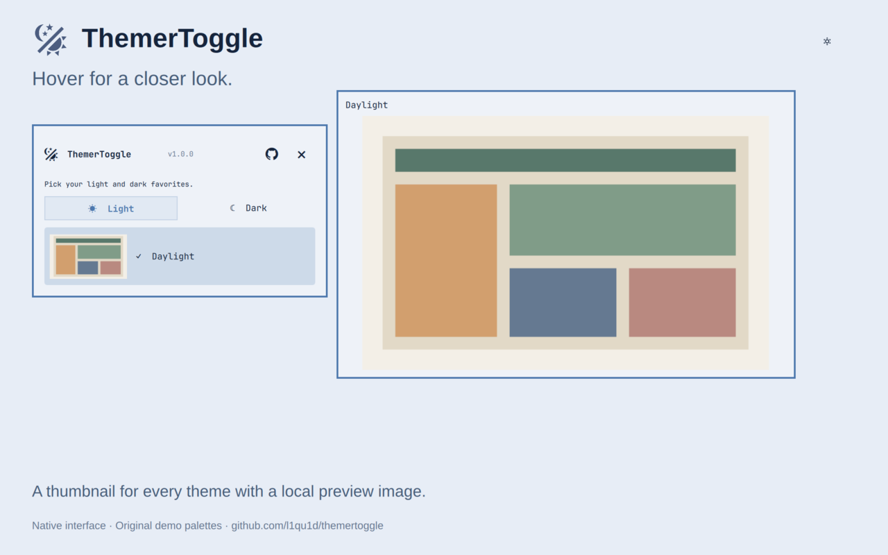
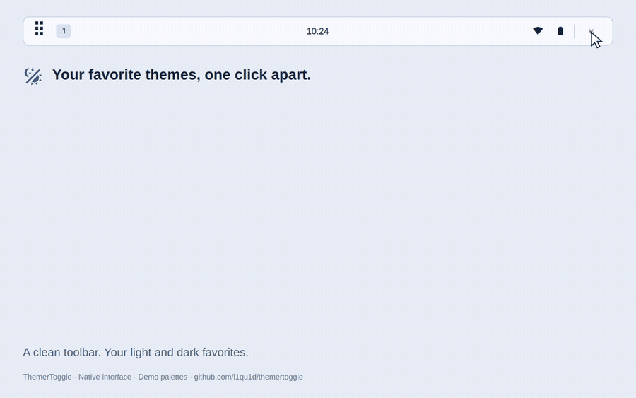

<p align="center">
  <picture>
    <source media="(prefers-color-scheme: dark)" srcset="assets/logo-light.svg">
    
  </picture>
</p>

<h1 align="center">ThemerToggle</h1>

<p align="center">Switch between your favorite Omarchy themes from the bar.</p>

ThemerToggle is a native Omarchy bar widget for keeping a light theme
and a dark theme close at hand. Left click toggles between your remembered
choices. Right click opens a selector where you can browse every installed
theme, see local previews, and choose a theme directly.

## Quick links

[Features](#features) · [Preview](#preview) · [Demo](#demo) · [Install](#install) ·
[Usage](#usage) · [Disable or remove](#disable-or-remove) · [Theme discovery](#theme-discovery) · [Optional CLI](#optional-cli) ·
[Development](#development) · [Security](#security) · [License](#license)

## Features

- Keep one light theme and one dark theme as your personal toggle pair.
- Browse stock themes, custom themes, and user overlays in equal Light and Dark tabs.
- See local theme previews in the menu and a larger preview after hovering a thumbnail.
- Refresh the catalog as themes change, while keeping Omarchy’s own resolver,
  theme templates, app integrations, backgrounds, and hooks in charge.
- Get an animated loading icon while Omarchy applies a theme, with the next
  action available as soon as the shell’s critical theme update is committed.
- Keep your own keyboard shortcuts. ThemerToggle has no built-in keybindings.

## Preview



The screenshot uses original demonstration palettes to show the selector.

## Demo

[](assets/demo.mp4)

The video records the native interface using original demonstration palettes
and a mock theme setter. It illustrates the controls and previews; theme-switch
timing depends on your Omarchy installation.

Download the [MP4 video](assets/demo.mp4), [logo](assets/logo.svg), or
[1280 × 640 social preview](assets/social-preview.png).

## Install

ThemerToggle currently installs directly from this private GitHub repository.
You need Omarchy with its Quickshell shell, Python 3.10 or newer, and
the installed `omarchy` and `omarchy-theme-color` commands. Python uses only its
standard library, and the plugin does not need a separate installer or service.

```bash
omarchy plugin add https://github.com/l1qu1d/themertoggle.git --enable
```

While the repository is private, your existing GitHub access must be able to
clone it. After it becomes public, the same command works without repository
access being granted first.

The widget appears in the right bar section by default. Move it with Omarchy’s
bar settings or with:

```bash
omarchy bar move io.github.l1qu1d.themertoggle --section right
```

## Usage

Left click the bar icon to toggle to the remembered theme in the other mode.
Right click to open the selector. Choose Light or Dark, then select a row to
apply and remember that theme. A check marks the active theme and a highlight
marks the remembered choice for the selected mode. Press Escape or the close
control to dismiss the selector.

The switch starts immediately. The spinner lasts until the shell has loaded
the new theme. Once Omarchy has committed its critical theme update, another
action can begin even when slower user hooks are still running; those hooks
remain supervised and any failure is reported. If that early readiness signal
cannot be confirmed, the helper waits for the command to finish before
reporting readiness.

The selector header shows the plugin version, a Source button, and a close
control. The Source button always opens
<https://github.com/l1qu1d/themertoggle> in your default browser when clicked.
The plugin itself makes no network requests. If you want a keyboard shortcut,
bind the optional CLI command in your own desktop configuration.

## Theme discovery

The catalog combines packaged themes from `/usr/share/omarchy/themes` with
themes in `~/.config/omarchy/themes`. A user theme with the same ID overlays its
packaged counterpart, so local customization remains effective. Modes are
resolved with Omarchy’s `omarchy-theme-color` helper, including custom palettes
and the normal `light.mode` marker behavior.

For each theme, ThemerToggle checks the user directory before the packaged
directory for `preview.png`, `preview.jpg`, `preview.jpeg`, `preview.webp`,
`preview.gif`, or `preview.bmp`. If there is no named preview, it uses the first
still image in `backgrounds/`. Themes without a still image keep a Light or Dark
placeholder icon. The catalog refreshes when the selector opens, when Omarchy’s
current theme changes, and once a minute as a fallback.

Selections are stored in:

```text
~/.local/state/omarchy-themertoggle/preferences.json
```

If a remembered theme is removed, the first available theme in that mode is
used. If the opposite mode has no available theme, the plugin reports an error
without applying a replacement.

## Optional CLI

The backend can also be called directly from the installed plugin directory:

```bash
PLUGIN="$HOME/.config/omarchy/plugins/io.github.l1qu1d.themertoggle"

python3 "$PLUGIN/theme_toggle.py" toggle
python3 "$PLUGIN/theme_toggle.py" select catppuccin-latte
python3 "$PLUGIN/theme_toggle.py" list
python3 "$PLUGIN/theme_toggle.py" status
```

`list` returns the theme catalog as one JSON object. `status` reports whether a
plugin switch is in its critical section. `toggle` and `select` emit
newline-delimited JSON: a `ready` event after Omarchy commits the shell update,
followed by the final result after the setter and its remaining hooks finish.
Requests received while another switch is in its critical section return a
busy result instead of being queued.

## Disable or remove

```bash
omarchy plugin disable io.github.l1qu1d.themertoggle
omarchy plugin remove io.github.l1qu1d.themertoggle --yes
```

Disabling or removing the plugin leaves your current Omarchy theme unchanged.
Preferences remain available for a later reinstall. Remove any shortcut you
created yourself if you no longer need it.

## Development

Run the backend tests and the Omarchy manifest check with:

```bash
python3 -m unittest discover -s tests -v
omarchy plugin validate .
```

The native QML smoke test needs Quickshell, QtTest, ripgrep, and a running
Wayland session:

```bash
bash tests/qml-smoke.sh
```

See [CONTRIBUTING.md](CONTRIBUTING.md) for the development workflow and
[RELEASING.md](RELEASING.md) for release preparation. The manifest and displayed
version remain `1.0.0` while this repository is private. Public visibility and
marketplace publication are separate steps, and this project does not claim
marketplace approval before that process completes.

## Security

ThemerToggle runs as your user inside Omarchy’s unsandboxed Quickshell shell. It
reads local theme files and preview images, writes its preference and lock files,
and invokes `omarchy theme set <theme-id>` with an argument list. It does not
download code, collect telemetry, use sudo, install services, or edit keyboard
bindings. Omarchy’s own theme command and user hooks may have additional
effects. The Source button opens the fixed repository URL only when clicked.

See [SECURITY.md](SECURITY.md) for runtime details and vulnerability reporting.

## License

ThemerToggle is licensed under [GPL-3.0-only](LICENSE). Omarchy, Quickshell, Qt,
Python, and system icon and font resources are external runtime dependencies.
See [THIRD_PARTY_NOTICES.md](THIRD_PARTY_NOTICES.md) for the dependency and demo
artwork notices.
